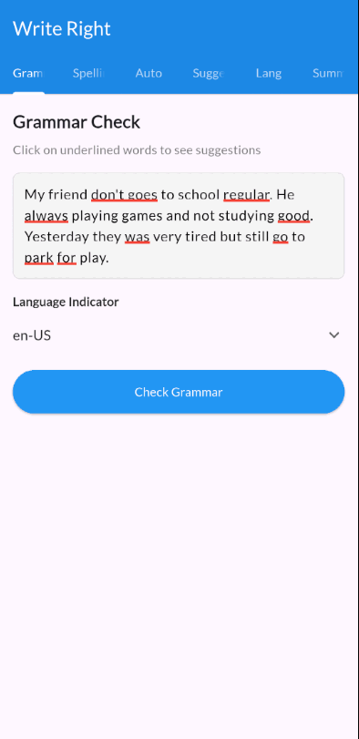

# Write Right
Write Right integrates the [TextGear API](https://textgears.com/) to perform: `Grammar Check`, `Spelling Correction`,`Auto Correction`,`Text Suggestion`, `Language Detection` and `Text Summarization`.

**Challenge**: Achieving inline error highlighting like Grammarly while keeping the cursor aligned. A transparent TextField over RichText looked correct visually but caused cursor-position mismatch and bad editing UX.

**Solution**: Replaced the layered UI with a single `TextField` and a custom `TextEditingController` overriding `buildTextSpan()`. Added gesture recognizers for clickable error spans and overlay popups for suggestions. Architecture inspired by [languagetool_textfield](https://pub.dev/packages/languagetool_textfield), resulting in accurate cursor behavior and interactive grammar highlights.
 

## Preview

